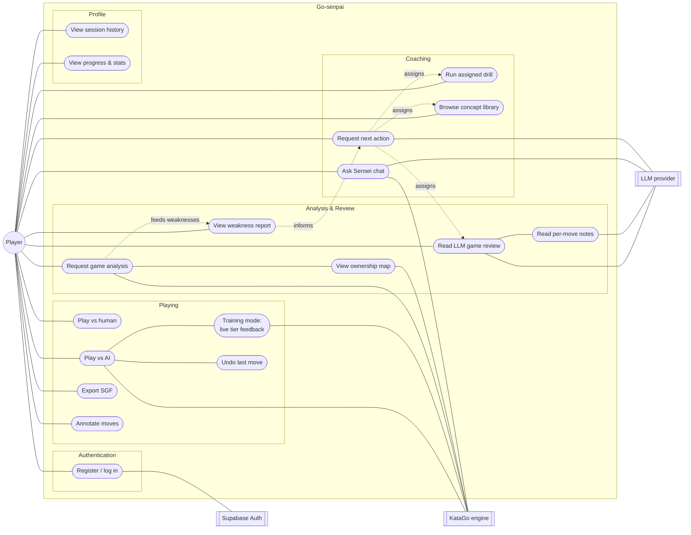
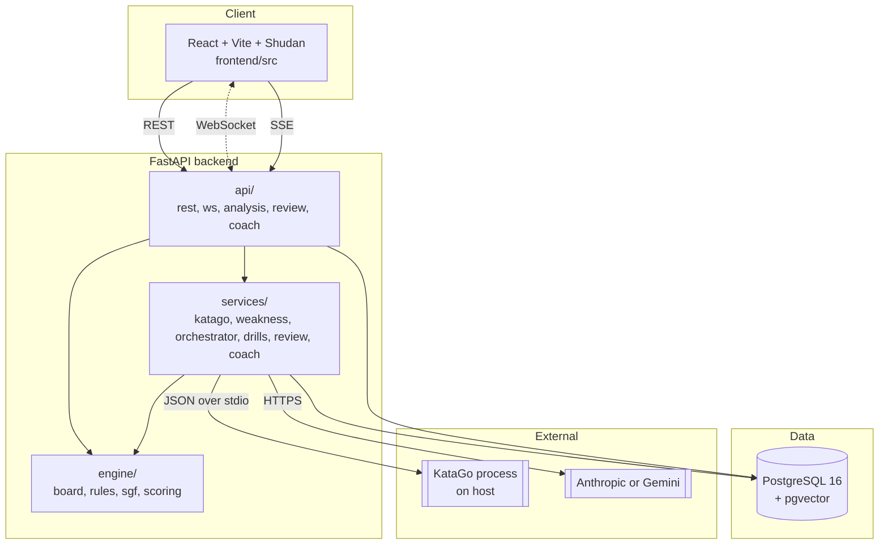

# Go-senpai

An agentic Go coach that pairs KataGo with an LLM to help you play, review, and drill.

> **Status:** Core feature set is complete: game engine, analysis pipeline, coaching backend, and a styled React frontend. KataGo and LLM keys are optional — the game layer works without them.

---

## Problem statement

The game of Go has a famously long learning curve. A strong human teacher can point at a move and tell a student *why* it was wrong and *what concept* to study next, but human coaching is expensive and scarce outside a handful of Go clubs. Learners are left with two unsatisfying tools:

1. **Raw engines** such as KataGo. These are superhumanly strong and can tell you that a move lost 3.2 points, but they do not explain *why* in human terms, do not track recurring weaknesses across games, and do not assign follow-up practice.
2. **General-purpose LLMs.** These can talk about Go in natural language, but they hallucinate on concrete board positions — they will happily invent stones, misread captures, and recommend illegal moves.

**Go-senpai ("Sensei")** is a class project that tries to close this gap by pairing the two. KataGo provides grounded numerical truth about every move (points lost, top alternative, win-rate swing, ownership delta). A deterministic orchestrator turns those numbers into a small set of human-readable *weaknesses* (e.g. "ignores opponent's last move", "overplays in the opening"). An LLM is then called with tightly scoped prompts and a curated concept library to produce explanations and pick drills, without ever being asked to read the board itself. The result is an agentic coach that plays, reviews, and drills — one that is grounded by an engine and pedagogical by an LLM.

---

## Features

- Play Go (9×9, 13×13, 19×19) against another human or a KataGo AI opponent
- Real-time board sync over WebSocket
- Training mode: live coaching tier-dots during AI games (green/yellow/red per move)
- Undo last move pair in AI games
- Post-game analysis via KataGo (points lost, top-move comparison, per-move features, ownership map overlay)
- LLM game review using Anthropic or Gemini — move-by-move explanations with concept links, displayed in the game viewer
- Weakness detection across 6 themes: opening/middlegame/endgame blunders, top-move avoidance, consistency
- Coaching orchestration: weakness → concept teaching → drill assignment, with action-history feedback loop that prevents the planner from repeating the same suggestion
- Agent orchestrator endpoint `POST /api/users/{id}/next-action`: dispatches between review, teach, revisit, and drill actions via an explicit rule table
- Interactive coaching chat ("Ask Sensei") — SSE-streamed responses in 4 modes: what's missing, help read a fight, what's my plan, follow-up
- Player move notes: personal annotations on individual moves, persisted per user
- Direct drill links via `GET /api/problems/:id` — shareable URLs to specific tsumego problems
- Session history feed: `GET /api/users/{id}/action-history` — reverse-chrono log of every planner pick
- SGF export

---

## Use-case diagram



The player is the only human actor. KataGo provides grounded numerical evaluation for any use case touching the board (AI opponent, training feedback, post-game analysis, coaching chat context). The LLM is used only for prose generation (game review, per-move notes, coaching chat, next-action orchestration) — never for board reading. The dashed arrows show the coaching data flow: analysis feeds the weakness model, which informs the orchestrator, which assigns the next action.

---

## Class diagram

```mermaid
classDiagram
    class Board {
        +int size
        +place(x, y, color)
        +remove_group(group)
        +hash() bytes
    }
    class Group {
        +stones
        +liberties
    }
    class Rules {
        +is_legal(board, move)
        +apply(board, move)
    }
    class Game {
        +id
        +board: Board
        +moves: list~Move~
        +play(move)
        +resign()
    }
    class SGF {
        +load(text) Game
        +dump(game) text
    }
    class Scoring {
        +area_score(board, komi)
    }

    class KataGoClient {
        +analyze(position) Analysis
        +genmove(position) Move
    }
    class WeaknessDetector {
        +detect(game) list~Weakness~
    }
    class DrillSelector {
        +select(weakness) Drill
    }
    class Orchestrator {
        +choose(weaknesses, history) Action
    }
    class ReviewService {
        +generate(game) Review
    }
    class CoachService {
        +invoke(game, mode, input) StreamingResponse
    }

    class User
    class GameRecord {
        +id
        +black_user_id
        +white_user_id
        +sgf
    }
    class Move {
        +move_number
        +color
        +coord
    }
    class MoveFeature {
        +points_lost
        +policy_rank
        +top_move
        +phase
        +is_blunder
    }
    class PositionAnalysis {
        +position_hash
        +raw_response
    }
    class GoConcept {
        +id
        +title
        +tags
        +embedding
    }
    class Review {
        +summary_md
        +moments
    }
    class PlayerNote {
        +game_id
        +move_number
        +user_id
        +body
    }
    class Problem {
        +id
        +sgf
        +solution
        +themes
        +difficulty
    }
    class DrillAttempt {
        +user_id
        +problem_id
        +success
        +hint_used
    }
    class UserWeakness {
        +user_id
        +theme
        +severity
        +evidence_count
    }
    class UserConcept {
        +user_id
        +concept_id
        +times_taught
        +demonstrated
    }
    class ActionHistory {
        +user_id
        +kind
        +game_id
        +reason
        +picked_at
    }

    Game "1" --> "*" Move
    Game "1" --> "1" Board
    Rules ..> Board
    SGF ..> Game
    Scoring ..> Board

    GameRecord "1" --> "*" Move
    GameRecord "1" --> "*" MoveFeature
    GameRecord "1" --> "*" PlayerNote
    MoveFeature "*" --> "1" PositionAnalysis
    Review "*" --> "1" GameRecord
    User "1" --> "*" GameRecord
    User "1" --> "*" UserWeakness
    User "1" --> "*" UserConcept
    User "1" --> "*" ActionHistory
    User "1" --> "*" DrillAttempt
    DrillAttempt "*" --> "1" Problem

    Orchestrator ..> WeaknessDetector
    Orchestrator ..> DrillSelector
    Orchestrator ..> GoConcept
    Orchestrator ..> ActionHistory
    WeaknessDetector ..> MoveFeature
    KataGoClient ..> PositionAnalysis
    ReviewService ..> MoveFeature
    ReviewService ..> GoConcept
    CoachService ..> KataGoClient
    CoachService ..> GoConcept
```



The diagram separates three concerns: the pure **engine** classes (`Board`, `Group`, `Rules`, `Game`, `SGF`, `Scoring`) live under `backend/app/engine/`; the **service** classes (`KataGoClient`, `WeaknessDetector`, `Orchestrator`, `DrillSelector`, `ReviewService`) live under `backend/app/services/`; the **persistence** entities (`User`, `GameRecord`, `Move`, `MoveFeature`, `PositionAnalysis`, `GoConcept`, `Review`) are defined in `backend/db/init.sql`.

---

## Architecture



Two request flows matter most:

- **Live play.** The browser opens a WebSocket to `api/ws`, every move is validated by the `engine/` layer, persisted as a `Move` row, and broadcast to the opponent. If the opponent is AI, `services/katago/` generates the reply.
- **Post-game analysis and coaching.** `POST /api/games/{id}/analyze` sends every position to the KataGo process, stores raw responses in `position_analyses`, derives per-move metrics into `move_features`, and hands the result to `services/orchestrator/`. The orchestrator reads the user's recent action history to avoid repeating suggestions, then calls `services/weakness/` to classify the player's mistakes, `services/drills/` to pick follow-up practice, and optionally `services/review/` to ask the LLM for a natural-language summary grounded in those features and the `go_concepts` library (retrieved via pgvector similarity search). Results are surfaced in the game viewer's analysis and review tabs.

---

## Onboarding guide for new team members

Welcome. This section is long on purpose — read it once end-to-end before touching code, and you will save yourself a week of confusion. It assumes you have cloned the repo, installed the prerequisites, and can run the backend and frontend locally. Everything else is explained from scratch.

### 1. What we are actually building

"Sensei" (code name `Go-senpai`) is an **agentic Go coach**. A beginner plays a game in the browser; the system analyses it with a strong Go engine; a deterministic pipeline classifies the player's mistakes; an LLM writes a human-readable review and assigns a drill. The key insight driving the design is this: **the engine is never trusted to teach, and the LLM is never trusted to read the board.** The engine produces numbers. The orchestrator turns numbers into weakness labels. The LLM turns labels into prose. If you remember nothing else from this section, remember that split — it is the reason the architecture looks the way it does.

### 2. A five-minute tour of the code

```
Go-senpai/
├── backend/                      ← FastAPI, Python 3.11
│   ├── app/
│   │   ├── main.py               ← FastAPI app factory, CORS, startup hooks
│   │   ├── api/                  ← HTTP and WebSocket endpoints
│   │   │   ├── rest.py           ← users, games, moves, drills, action-history
│   │   │   ├── ws.py             ← live-play WebSocket
│   │   │   ├── analysis.py       ← POST /games/{id}/analyze, ownership
│   │   │   ├── review.py         ← LLM review + per-move notes
│   │   │   └── coach.py          ← SSE coaching chat (Ask Sensei)
│   │   ├── engine/               ← Pure Go rules, no I/O, no DB
│   │   │   ├── board.py          ← Board state, Zobrist hashing
│   │   │   ├── group.py          ← Stone groups, liberty counting
│   │   │   ├── rules.py          ← Legality, ko, suicide
│   │   │   ├── game.py           ← Move history, turn tracking
│   │   │   ├── coords.py         ← A1 ↔ (x, y) helpers
│   │   │   ├── scoring.py        ← Area / Chinese scoring
│   │   │   └── sgf.py            ← SGF parse and dump
│   │   ├── services/             ← Where the "agentic" part lives
│   │   │   ├── katago/           ← Subprocess client, request queue, live analysis
│   │   │   ├── weakness/         ← 6 theme detectors
│   │   │   ├── drills/           ← Tsumego selection
│   │   │   ├── orchestrator/     ← Deterministic coaching planner + action history
│   │   │   ├── review/           ← LLM prompt building + call
│   │   │   └── coach/            ← SSE session manager, multi-turn coaching
│   │   ├── db.py                 ← asyncpg pool, query helpers
│   │   ├── schemas.py            ← Pydantic request / response models
│   │   └── sessions.py           ← Cookie-based session auth
│   └── db/init.sql               ← Consolidated schema (run once in Supabase SQL Editor)
├── frontend/                     ← React 18 + Vite + TypeScript
│   └── src/
│       ├── App.tsx               ← Router + auth bootstrap
│       ├── api.ts                ← typed fetch helpers
│       ├── ws.ts                 ← WebSocket client
│       ├── types.ts              ← shared TypeScript types
│       ├── routes/               ← Page components
│       │   ├── Home.tsx          ← Dashboard: recent games, weaknesses, Sensei card
│       │   ├── Lobby.tsx         ← Create / join game
│       │   ├── PlayGame.tsx      ← Active game shell
│       │   ├── GameViewer.tsx    ← Replay + analysis + review tabs
│       │   ├── Coach.tsx         ← Sensei planner + action history feed
│       │   ├── Drill.tsx         ← Tsumego practice
│       │   ├── Profile.tsx       ← Weaknesses, concepts, progress charts
│       │   ├── Games.tsx         ← Game history list
│       │   ├── Concepts.tsx      ← Concept library
│       │   └── Settings.tsx      ← Board theme, stone style, preferences
│       ├── components/           ← Shared UI components
│       │   ├── GoBoard.tsx       ← Wrapper around @sabaki/shudan
│       │   ├── MoveHistory.tsx   ← Sidebar move list
│       │   ├── ChatDrawer.tsx    ← Ask Sensei streaming chat
│       │   ├── ActionCard.tsx    ← Rendered coaching action
│       │   ├── WeaknessBar.tsx   ← Severity bar
│       │   ├── Sparkline.tsx     ← Progress mini-charts
│       │   └── PlayerNoteInput.tsx ← Per-move annotations
│       └── lib/                  ← Auth, replay, SGF, HTTP helpers
└── backend/db/init.sql           ← Run once in Supabase SQL Editor to create the schema
```

**The golden rule of the backend layers:** `api/` may call `services/` and `engine/`; `services/` may call `engine/` and the DB; `engine/` depends on nothing. If you find yourself importing `app.db` from inside `engine/`, stop — you are about to break a test.

### 3. Why each technology is there

- **FastAPI + asyncpg.** We need async because the KataGo client is long-lived and streams responses; blocking the event loop would freeze live games. FastAPI gives us request validation via Pydantic for free. asyncpg (not SQLAlchemy) because our queries are small, handwritten, and we wanted to stay close to SQL.
- **PostgreSQL + pgvector.** Postgres is obvious; pgvector is for semantic retrieval over the `go_concepts` table when the LLM review asks "find me a concept that matches this weakness". 384-dimensional sentence-transformer embeddings, cosine similarity, `ivfflat` index.
- **React + Vite + TypeScript.** Vite for fast reloads. TypeScript because the API payloads are intricate (move features, weakness reports) and compile-time types save a lot of debugging.
- **@sabaki/shudan.** A battle-tested Go board component. It is written in **Preact**, not React, which is why `vite.config.ts` contains aliases mapping `preact` and `preact/hooks` to `react` — without those aliases the board renders as a blank page. This trips up everyone exactly once.
- **KataGo.** Strongest open-source Go engine. Runs as a separate process on the host (not in Docker — GPU access is messy). We speak to it over stdio using its JSON "analysis engine" protocol.
- **LLM (Anthropic or Gemini).** Interchangeable. Selected at runtime via `REVIEW_LLM_PROVIDER`. Only used for prose generation and drill selection, never for board reading.

### 4. The two request flows you need to understand

**Flow A — Live play.** Browser loads `GameView`, opens a WebSocket to `/api/ws/{game_id}`, sends move messages. The server validates the move through `engine/rules.py`, writes a row to `moves`, re-broadcasts to the other player. If the opponent is AI, `services/katago/` is asked for a reply, and the same path writes the AI's move. No LLM involvement. This path must stay fast (<100ms for human moves, <2s for AI moves).

**Flow B — Post-game coaching.** User clicks "Analyse" → `POST /api/games/{id}/analyze`. The backend:

1. Iterates every position in the game and sends it to KataGo.
2. Caches raw KataGo output in `position_analyses` (keyed by Zobrist hash — replays and transpositions are free after the first analysis).
3. Computes per-move features (`points_lost`, `policy_rank`, `top_move`, phase, `is_blunder`, etc.) into `move_features`.
4. Hands the feature table to `services/orchestrator/`, which calls each detector in `services/weakness/` and produces a ranked list of weaknesses.
5. Picks relevant concepts from `go_concepts` via pgvector similarity, and a drill via `services/drills/`.
6. (Optional) Calls `services/review/` which constructs a prompt containing *only* the labelled weaknesses and retrieved concepts — never the raw board — and asks the LLM for a markdown review.

Flow B is what makes this project "agentic". The orchestrator is a plain Python state machine; it is the thing choosing tool calls, not the LLM.

### 5. How to run and debug things

```bash
cd backend && uvicorn app.main:app --reload
cd frontend && npm run dev
```

- **Backend logs:** watch the uvicorn terminal. Weakness detectors and the orchestrator log every decision at INFO level.
- **KataGo not responding?** Run `katago.exe analysis -config ...` manually in a terminal first. OpenCL tuning takes ~5 minutes the first time and looks like a hang but isn't.
- **Frontend blank page?** 99% of the time it's the Preact alias. Check `frontend/vite.config.ts`.
- **DB schema out of date?** Re-run `backend/db/init.sql` in the Supabase SQL Editor (wipes and recreates all tables).
- **Concepts or problems missing?** Run `python scripts/load_problems.py` and `python -m app.services.review.corpus.loader` from `backend/`. Both are safe to re-run.
- **Tests:** `pytest -q` from `backend/`. Expect **41 passed**. If you touch `engine/` or `services/`, add a test. The engine tests are fast and deterministic; please keep them that way.

### 6. Conventions we have converged on

- **Don't mock the database in tests.** Integration tests hit a real Postgres (either the dockerised one or a throwaway schema). Mock engines lie.
- **Engine code is pure.** No network, no DB, no logging beyond exceptions. This is what keeps the tests fast.
- **Services are stateless.** State lives in the DB. A service instance should be safe to construct per-request.
- **Prompts live next to the service that uses them**, as plain Python string templates — not in a separate "prompts/" folder. When the prompt and the code drift apart, bugs follow.
- **Secrets go in `.env`, never in code or commits.** The repo has a `.env.example`; copy it.
- **Commit messages are short and imperative** ("add weakness detector for top-move avoidance", not "Added..."). Match the existing `git log` style.

### 7. Where to start as a new contributor

Pick one of these depending on your interest; all three are real, unblocked tickets:

1. **Add a weakness detector.** The framework is in `services/weakness/`; each detector is ~50 lines. Ideas: "ignores ko threats", "plays too slowly in the opening", "fails to respond to a kikashi". Write the detector, add a test with a canned `move_features` fixture, register it in the orchestrator.
2. **Wire sound effects and animations.** `frontend/src/routes/Settings.tsx` already has toggles for both; they are stored in localStorage but nothing reads them yet. Hook them into `GoBoard.tsx` (stone placement sound) and the move transition CSS.
3. **Multi-device settings sync.** Settings are currently localStorage-only. Add a `user_settings` column or table, a `PATCH /api/users/me/settings` endpoint, and sync on login.

### 8. People and communication

Six-person team, class project. Decisions that affect more than one module should be discussed in the group chat before being merged. When in doubt: open a draft PR, link the relevant files with line numbers, and ask for a review. Small PRs are easier to approve than large ones — split aggressively.

---

## Tech stack

| Layer | Tech |
|---|---|
| Frontend | React 18 + Vite + TypeScript + @sabaki/shudan |
| Backend | FastAPI + asyncpg + Python 3.11 |
| Database | PostgreSQL 16 + pgvector (Supabase) |
| Analysis | KataGo (runs on host) |
| LLM review | Anthropic Claude or Google Gemini |

---

## Prerequisites

- **Python 3.11+**
- **Node 18+**
- **Supabase account** — the database is hosted on Supabase; get the project URL, anon key, and connection string from a teammate (or create your own project at supabase.com)
- **KataGo** binary + network file *(optional — only needed for post-game analysis)*

---

## Getting started

### 1. Configure and run the backend

```bash
cd backend
cp .env.example .env
```

Edit `.env`: set `DATABASE_URL` to the shared Supabase connection string (get it from a teammate). `KATAGO_ENABLED=false` is already the default.

> **Password has special characters?** (`@`, `#`, `[`, `]`, etc.) Percent-encode it:
> ```python
> from urllib.parse import quote_plus; print(quote_plus("your_password"))
> ```

Install and verify:

```bash
pip install -e ".[dev]"
pytest -q          # expect 41 passed
uvicorn app.main:app --reload
```

The server listens on `http://localhost:8000`.

### 2. Seed the database

Run once after the schema is in place (both commands are safe to re-run — they upsert):

```bash
cd backend
python scripts/load_problems.py                  # tsumego problems
python -m app.services.review.corpus.loader      # Go concepts + embeddings
```

The concept loader downloads a small sentence-transformer model on first run (~90 MB). If you have `REVIEW_EMBEDDING_MODEL` unset it defaults to `sentence-transformers/all-MiniLM-L6-v2`.

### 3. Run the frontend

```bash
cd frontend
npm install
cp .env.example .env.local
# Edit .env.local: fill in VITE_SUPABASE_URL and VITE_SUPABASE_ANON_KEY
# (Supabase dashboard → Project Settings → API)
npm run dev
```

Open `http://localhost:5173`. Create a user, create a game, and play.

### 4. Drive the coaching loop (curl walkthrough)

Once you have played at least one game to completion, the backend exposes a single endpoint that drives the whole coaching pipeline. It decides the *next action* for the user by consulting a deterministic rule table:

1. **`review_game`** — an unreviewed finished game exists for this user.
2. **`revisit_concept`** — a concept we already taught, not yet demonstrated, and ≥24h old.
3. **`teach_concept`** — the user has an active weakness (severity ≥ 0.2) mapped to a concept they haven't seen.
4. **`serve_drill`** — default; returns a tsumego matched to weakness themes.
5. **`idle`** — nothing to do (empty corpus).

The sequence below reproduces the demo the coaching pipeline was built for. Substitute your own `user_id`/`game_id` values. Commands work as-is in Windows `cmd.exe`; on bash you may swap the escaped quotes for single quotes.

```bash
:: 1. Ask what to do next — if you have an unreviewed game, this returns review_game.
curl -s -X POST http://localhost:8000/api/users/{user_id}/next-action | python -m json.tool

:: 2. Generate the LLM review for that game.
curl -s -X POST "http://localhost:8000/api/games/{game_id}/review?for_user_id={user_id}" | python -m json.tool

:: 3. Ask again — now usually teach_concept (if a weakness ≥ 0.2) or serve_drill.
curl -s -X POST http://localhost:8000/api/users/{user_id}/next-action | python -m json.tool

:: 4. Record a drill attempt. success=true also auto-marks matching concepts as demonstrated.
curl -s -X POST http://localhost:8000/api/drill-attempts ^
     -H "content-type: application/json" ^
     -d "{\"user_id\":\"{user_id}\",\"problem_id\":\"starter-04-twopoint-eye\",\"success\":true,\"moves_played\":[],\"hint_used\":false}"

:: 5. Ask again — the recency penalty kicks in, so the served problem changes.
curl -s -X POST http://localhost:8000/api/users/{user_id}/next-action | python -m json.tool
```

Peek at the state the orchestrator just updated:

```bash
:: Current weaknesses with their EMA severities
curl -s http://localhost:8000/api/users/{user_id}/weaknesses | python -m json.tool
```

Tip: to force the `teach_concept` branch when no weakness has crossed the 0.2 threshold yet, bump one directly in the Supabase SQL Editor:

```sql
UPDATE user_weaknesses SET severity = 0.5 WHERE user_id = '{user_id}' AND theme = 'low_consistency_opening';
```

---

## KataGo setup (optional)

Required only for post-game analysis (`POST /api/games/{id}/analyze`). KataGo runs on the host, not in Docker.

1. Download a Windows OpenCL release from <https://github.com/lightvector/KataGo/releases> and unzip into `C:\tools\katago\`.
2. Download a network file from <https://katagotraining.org/networks/> (recommended: `kata1-b28c512nbt-s12763923712-d5805955894.bin.gz`) and save it into the same folder.
3. Duplicate `analysis_example.cfg` → `analysis.cfg`. Edit it:
   ```
   numAnalysisThreads = 1
   numSearchThreadsPerAnalysisThread = 1
   maxVisits = 500
   ```
4. Run once to complete OpenCL tuning (~5 min, one-time):
   ```powershell
   C:\tools\katago\katago.exe analysis -config C:\tools\katago\analysis.cfg -model C:\tools\katago\<network>.bin.gz < NUL
   ```
   Wait for `Started, ready to begin handling requests`, then Ctrl+C.
5. Set in `.env`:
   ```
   KATAGO_ENABLED=true
   KATAGO_BIN=C:\tools\katago\katago.exe
   KATAGO_CONFIG=C:\tools\katago\analysis.cfg
   KATAGO_MODEL=C:\tools\katago\<network>.bin.gz
   ```

---

## Environment variables

**Backend (`backend/.env`):**

| Variable | Required | Description |
|---|---|---|
| `DATABASE_URL` | Yes | Supabase PostgreSQL connection string (Session pooler URL) |
| `SUPABASE_PROJECT_REF` | No | Enables JWT auth; your Supabase project ref (e.g. `vrsogktirpdmbkjvyxky`). When unset, auth is disabled (dev mode). |
| `CORS_ORIGINS` | No | Comma-separated allowed origins (default: `http://localhost:5173,http://localhost:5174`) |
| `KATAGO_ENABLED` | No | Enable KataGo analysis (`true`/`false`) |
| `KATAGO_BIN` | If enabled | Path to `katago.exe` |
| `KATAGO_CONFIG` | If enabled | Path to `analysis.cfg` |
| `KATAGO_MODEL` | If enabled | Path to network `.bin.gz` |
| `KATAGO_MAX_VISITS` | No | Search visits per move (default `500`) |
| `KATAGO_ANALYZE_TIMEOUT` | No | Max seconds for a full-game analysis (default `60`) |
| `KATAGO_TIMEOUT_PER_TURN` | No | Seconds per turn (default `8`) |
| `REVIEW_LLM_PROVIDER` | No | `gemini` or `anthropic` |
| `REVIEW_LLM_MODEL` | No | e.g. `gemini-2.5-flash`, `claude-sonnet-4-6` |
| `GOOGLE_API_KEY` | If Gemini | Gemini API key |
| `ANTHROPIC_API_KEY` | If Anthropic | Anthropic API key |
| `REVIEW_EMBEDDING_MODEL` | No | Sentence-transformer model for concept retrieval (default: `all-MiniLM-L6-v2`) |

**Frontend (`frontend/.env.local`):**

| Variable | Required | Description |
|---|---|---|
| `VITE_SUPABASE_URL` | Yes | `https://<project-ref>.supabase.co` |
| `VITE_SUPABASE_ANON_KEY` | Yes | Public anon key from Supabase → Project Settings → API |

---

## Running tests

```bash
cd backend
pytest -q
```

---

## Conclusions

What works today: a clean Go engine with full rule enforcement and SGF I/O, live human-vs-human and human-vs-AI play over WebSocket, a KataGo analysis pipeline that caches positions and derives per-move features, weakness detection across six themes, a deterministic orchestrator that picks concepts and drills (with an action-history feedback loop that prevents repeated suggestions), an LLM review service surfaced in the game viewer, an SSE coaching chat, and a styled React frontend covering all user flows.

What is still missing: sound effects and animations (settings exist but are not wired), multi-device settings sync (currently localStorage only), and additional weakness detectors beyond the current six themes.

What the team learned: separating the grounded engine from the pedagogical LLM is the single most important decision — asking an LLM to read the board fails, while asking it to explain a pre-computed weakness works. Small integration details (the `@sabaki/shudan` Preact→React alias in Vite) can block an entire page. And a deterministic orchestrator around a non-deterministic LLM is easier to debug, test, and trust than a single monolithic prompt.

---

## Notes

This is a class project ("Sensei") built by a 6-person team. The coaching pipeline (weakness detection → concept teaching → drill selection) is driven by a deterministic orchestrator in `backend/app/services/orchestrator/`.
